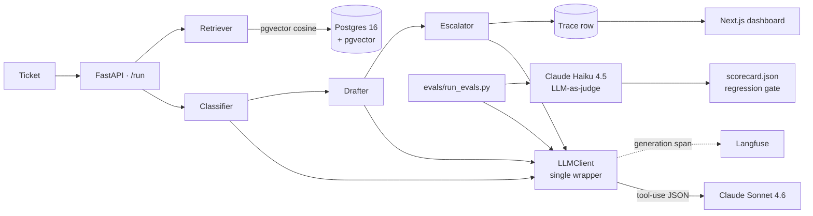

# inbox-agent

[](https://github.com/AmirD10224/inbox-agent/actions/workflows/ci.yml)
[](https://github.com/AmirD10224/inbox-agent/actions/workflows/evals.yml)
[](apps/api/pyproject.toml)
[](LICENSE)

Small customer-support agent. You feed it a ticket, it picks a category (billing, technical, account, refund, other), writes a draft reply, and decides whether to escalate to a human. Three Sonnet calls, everything goes through Anthropic's tool-use so the JSON is always valid, and there's an eval set that runs on every PR and blocks merge if quality drops.

Live demo: deploy to Modal + Vercel and replace this line. See [Deploy](#deploy).

## What it does

You paste a ticket. Three things happen:

1. The classifier picks one of `billing` / `technical` / `account` / `refund` / `other` and reports a confidence number.
2. The drafter writes a reply. If there's an FAQ source for that category, it pulls a couple of chunks and cites them inline.
3. The escalator decides whether a human should pick this up, and if so which team.

All three calls share a single LLM wrapper that does tool-use, validation, retries, and Langfuse tracing. Each call's input/output tokens come straight from Anthropic's `usage` field so the per-ticket dollar number is real, not estimated.

## Architecture



## Quick start

```bash
git clone https://github.com/AmirD10224/inbox-agent
cd inbox-agent
cp .env.example .env       # ANTHROPIC_API_KEY at minimum
make bootstrap             # uv install (api) + pnpm install (web)
make demo                  # boots Postgres, runs migrations
make dev-api               # http://localhost:8000
make dev-web               # http://localhost:3000
```

Open `localhost:3000`, pick a sample ticket, hit Run.

## Stack

| Layer | Choice | Notes |
| --- | --- | --- |
| LLM | Sonnet 4.6 (agent), Haiku 4.5 (judge) | Sonnet for the actual replies, Haiku for the eval judge, roughly 5x cheaper. |
| Format | Anthropic tool-use + Pydantic | If the model returns malformed JSON, Pydantic raises before we use it. |
| Embeddings | Voyage-3 (1024-dim) | Free tier is enough for the FAQ index. |
| Vector store | pgvector on Postgres 16 | One DB for ops + retrieval. |
| Tracing | Langfuse | No-op if you don't set the keys. |
| Logging | structlog (JSON) | |
| Web | Next.js 15 / React 19 / Tailwind v4 | |
| Deploy | Modal (API) + Vercel (web) | Both free tier for demo traffic. |
| Tests | pytest + respx | respx replays recorded Anthropic responses so CI doesn't burn tokens. |
| Quality | ruff, mypy strict, 75% coverage on the agent code | Coverage gate is on `inbox_agent.agent` and `inbox_agent.llm`. CRUD is excluded. |

## Env vars

See [.env.example](.env.example).

| Var | Required | Purpose |
| --- | --- | --- |
| `ANTHROPIC_API_KEY` | yes | All LLM calls |
| `VOYAGE_API_KEY` | yes (for `/ingest-faq`) | FAQ chunk embeddings |
| `DATABASE_URL` | yes | Postgres + pgvector |
| `LANGFUSE_PUBLIC_KEY` | no | Tracing |
| `LANGFUSE_SECRET_KEY` | no | Tracing |
| `LANGFUSE_HOST` | no | Defaults to `https://cloud.langfuse.com` |

## Cost per ticket

A single `/run` is 3 Sonnet calls (classify, draft, escalate).

| Step | Tokens (typical) | Cost |
| --- | ---: | ---: |
| Classify | 412 in / 78 out | $0.0024 |
| Draft (no FAQ) | 380 in / 96 out | $0.0026 |
| Draft (with FAQ context) | 720 in / 132 out | $0.0042 |
| Escalate | 510 in / 72 out | $0.0026 |
| **Total** | ~1.5–1.8k tokens | **~$0.008–$0.010** |

A full eval run is 50 goldens × (3 Sonnet calls + 1 Haiku judge call), so about $0.43. The smoke set (10 items) is $0.09.

## Tests

```bash
make test               # unit + integration, no docker
make test-e2e           # boots compose stack, hits live endpoints
make lint && make typecheck
```

## Evals

```bash
ANTHROPIC_API_KEY=sk-ant-... make evals       # full 50-item run
make evals-smoke                              # 10-item subset
```

Output is `evals/results/scorecard.json` and a Markdown summary suitable for a PR comment.

The CI workflow runs the smoke set on every PR, the full set when the PR is labelled `eval` or merged to `main`, posts a sticky PR comment with the diff vs `main`, and fails the workflow if any metric regresses by more than 5%.

## Deploy

### API → Modal

```bash
modal secret create inbox-agent-anthropic ANTHROPIC_API_KEY=sk-ant-...
modal secret create inbox-agent-voyage VOYAGE_API_KEY=pa-...
modal secret create inbox-agent-langfuse LANGFUSE_PUBLIC_KEY=... LANGFUSE_SECRET_KEY=... LANGFUSE_HOST=...
modal secret create inbox-agent-db DATABASE_URL=postgresql+psycopg://...
make deploy-modal
make smoke-modal MODAL_URL=https://...
```

### Web → Vercel

Push the repo, import in Vercel, set `NEXT_PUBLIC_API_BASE_URL` to your Modal URL. No build config needed.

## Troubleshooting

- **Managed Postgres (Neon, Supabase, RDS) and `CREATE EXTENSION` fails with `permission denied`.** Most managed providers gate `CREATE EXTENSION vector` behind a dashboard toggle. Enable `vector` in your provider's UI before running migrations. The migration uses `IF NOT EXISTS`, so once enabled, `make migrate` is idempotent.
- **`pgvector` not installed.** The migration runs `CREATE EXTENSION IF NOT EXISTS vector` but your Postgres image needs to ship with it. The `compose.yml` here uses `pgvector/pgvector:pg16`.
- **Langfuse traces don't show up.** Both keys have to be set. Without them the tracer is a deliberate no-op. Check `/health` → `langfuse_enabled`.
- **mypy errors in your editor about `inbox_agent.*`.** Run `make install-api` first. The package is declared editable in `pyproject.toml`.
- **`/ingest-faq` returns 400 'Could not extract'.** trafilatura couldn't find article-shaped HTML. Some FAQ pages are SPA-only; this demo doesn't render JS.
- **CI ruff fails but local ruff passes.** CI uses `ruff format --check`, not `ruff format`. Run with `--check`.

## Project layout

See [ARCHITECTURE.md](ARCHITECTURE.md).

## License

MIT. See [LICENSE](LICENSE).
